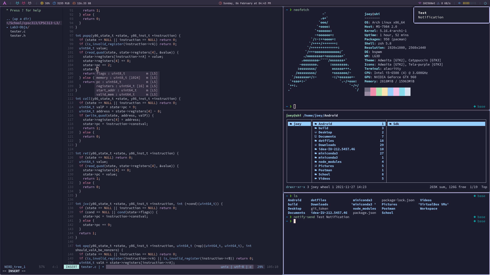
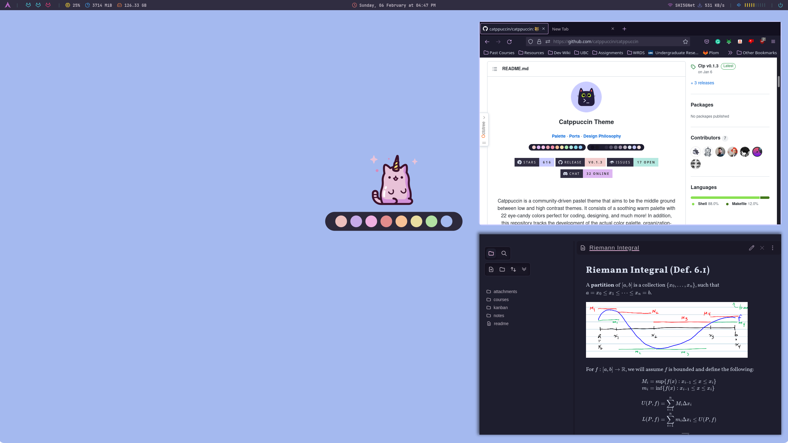

# dotfiles

Personal configuration files for running a stylish Arch Linux desktop environment

## Table of contents

- [Rice info](#rice-info)
- [Installation](#installation)
- [Window management tips](#window-management-tips)
- [Monitor settings](#monitor-settings)
- [Network settings](#network-settings)
- [Bluetooth settings](#bluetooth-settings)
- [Audio settings](#audio-settings)

|HDMI-0|DVI-I-1|
|-|-|
|||

## Rice info

- **Operating System**: Arch Linux
- **Window Manager**: bspwm
- **Display Manager**: lightdm
- **Task Bar**: polybar
- **Launcher**: rofi
- **Compositor**: picom (https://aur.archlinux.org/packages/picom-rounded-corners)
- **Terminal**: kitty
- **Shell**: zsh
- **File Manager**: thunar
    - `gvfs` required for usb devices
    - `xarchiver` required for creating and extracting zip files
- **Email Client**: thunderbird
- **Lockscreen**: betterlockscreen (https://github.com/betterlockscreen/betterlockscreen#how-it-works)
    - Regenerate lockscreen images with `betterlockscreen -u <path-to-image>`

## Installation

1. Clone repo into hidden directory
```bash
git clone git@github.com:joeyshi12/dotfiles ~/.dotfiles
```
2. Move themes, fonts, icons into local data folder and create symlinks
    - Configure assets with `lxappearance`
    - Terminal fonts: https://github.com/ryanoasis/nerd-fonts/tree/master/patched-fonts/SourceCodePro
    - Reload fonts: `fc-cache -v`
```bash
~/.dotfiles/bootstrap.sh
```
3. Install native packages
```bash
pacman -S $(cat ~/.dotfiles/pkglist)
```
4. Install yay
```bash
cd /opt
sudo git clone https://aur.archlinux.org/yay.git

cd yay
makepkg -si
```
5. Install foreign packages
```bash
yay -S $(cat ~/.dotfiles/pkglocallist)
```

## Window management tips

- Focus desktop: `super + {1-6}`
- Focus desktop on both monitors: `super + alt + {1-3}`
- Close focused window: `super + w`
- Focus window: `super + {h,j,k,l}`
- Swap focused window: `super + shift + {h,j,k,l}`

*Hotkey bindings configured in `.config/bspwm/sxhkd/sxhkdrc`*

## Monitor settings

- Look up resolutions of available monitors with `xrandr`
- Monitor orientation and resolution settings can be configured in `/etc/X11/xorg.conf.d/52-resolution-fix.conf`:
```
Section "Monitor"
    Identifier "HDMI-0"
    Option "PreferredMode" "2560x1440"
    Option "Primary" "1"
EndSection
Section "Monitor"
    Identifier "DVI-I-1"
    Option "PreferredMode" "1920x1080"
    Option "RightOf" "HDMI-0"
EndSection
```
- Workspace allocation across monitors is configured in `~/.config/bspwm/bspwmrc`:
```bash
bspc monitor HDMI-0 -d 1 2 3
bspc monitor DVI-I-1 -d 4 5 6
```

## Network settings

- Run `nmcli dev wifi` to scan for networks
- Run `nmtui` to open user interface for connecting to networks

## Bluetooth settings

1. Enable bluetooth services if not done so already
```bash
systemctl enable --now bluetooth
```
2. Automatically power on bluetooth adapter on boot by adding the following to `/etc/bluetooth/main.conf`:
```
[Policy]
AutoEnable=true
```
3. Scan for bluetooth devices and connect
```bash
bluetoothctl scan on &
bluetoothctl connect <dev>
```

## Audio settings

- Audio mixer: `pulsemixer`
- Sound server controller: `pactl`
- Terms: Output = Sink, Input = Source

**Manage Sound Devices**

- Find current sink/source with `pactl get-default-(sink|source)`
- List all available sinks/sources with `pactl list (sinks|sources)`
- Set sink/source with `pactl set-default-(sink-source)`
