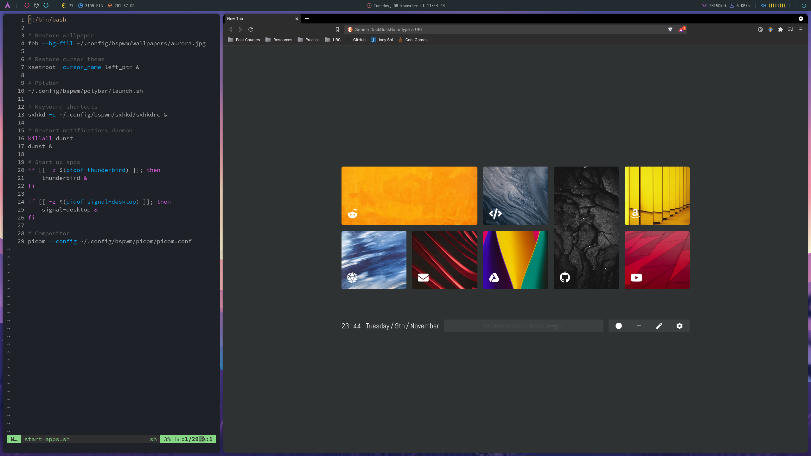

# dotfiles

Personal configuration files for running a stylish Arch Linux desktop environment

## Table of contents
- [Rice info](#rice-info)
- [Installation](#installation)
- [Window management tricks](#window-management-tricks)
- Settings info
    - [Monitor settings](#monitor-settings)
    - [Network settings](#network-settings)
    - [Bluetooth settings](#bluetooth-settings)
    - [Audio settings](#audio-settings)

HDMI-0 | DVI-I-1
------ | -------
 | 

## Rice info
- Window Manager: bspwm
- Display Manager: lightdm
- Task Bar: polybar
- Launcher: rofi
- Compositor: picom (requires a version with rounded corner support)
    - Arch: https://aur.archlinux.org/packages/picom-rounded-corners/
    - Ubuntu: https://github.com/yshui/picom/
- Terminal: alacritty
- GUI File Manager: thunar
    - Install `gvfs` if usb devices are not being listed
- Email Client: thunderbird
- Bootloader: grub
- Lockscreen: betterlockscreen (compile dependencies + repo from https://github.com/betterlockscreen/betterlockscreen#how-it-works)
    - Regenerate lockscreen images with `betterlockscreen -u <path-to-image>`

## Installation
- Install packages from pkglist with your package manager (may be one of `apt`, `pacman`, `dnf`, etc...).
    - Can simply use `pacman -S $(cat pkglist)` on Arch
- Manually install packages from pkglocallist
    - May want to use external package managers for community packages (use yay if on Arch)
- Install base themes, fonts, icons, and link dotfiles by running `./install.sh`
- Install additional themes, fonts, and icons by moving their unzipped folders into `~/usr/share/themes, fonts, icons` respectively
    - Fonts for the terminal: `npm install git://github.com/adobe-fonts/source-code-pro.git#release`  (https://github.com/ryanoasis/nerd-fonts/tree/master/patched-fonts/SourceCodePro)
    - Fonts for Steam (in case of text-rendering bugs): `pacman -S ttf-liberation`
    - `fc-cache -v` to reload font cache

## Window management tricks
- `super` is likely the windows key on your keyboard
- `super + {1-6}` will jump to the inputted workspace number (workspace distribution is given in `.config/bspwm/bspwmrc`)
- `super + alt + {1-3}`: if `n` is the inputted number, then will move workspaces on both monitors to the `nth` workspace from the left
- `super + w` close focused window
- `super + {h,j,k,l}` moves the focus on other windows
- `super + shift + {h,j,k,l}` moves the focused window
- More details can be found in `.config/bspwm/sxhkd/sxhkdrc`

## Monitor settings
- Monitor orientation and resolution settings are configured in `/etc/X11/xorg.conf.d/52-resolution-fix.conf`:
```
Section "Monitor"
    Identifier "HDMI-0"
    Option "PreferredMode" "2560x1440"
    Option "Primary" "1"
EndSection
Section "Monitor"
    Identifier "DVI-I-1"
    Option "PreferredMode" "1920x1080"
    Option "RightOf" "HDMI-0"
EndSection
```
- Workspace allocation across monitors is configured in `~/.config/bspwm/bspwmrc`
- View available monitors and modes by running `xrandr`

## Network settings
- Packages: `NetworkManager` (check to make sure this is installed)
- Run `nmcli dev wifi` to scan for networks
- Run `nmtui` to open user interface for connecting to networks

## Bluetooth settings
- Packages: `bluz bluez-utils`
- Enable bluetooth service `systemctl enable bluetooth.service`
- Power on bluetooth adapter on start:
    - Add `AutoEnable=true` under the `[Policy]` section of `/etc/bluetooth/main.conf`
- Scan for bluetooth devices with `bluetoothctl scan on` and connect using `connect <device-address>`

## Audio settings
- Packages: `pulseaudio-alsa pulseaudio-bluetooth pulsemixer`
- Run `pulsemixer` to manage audio from a terminal user interface
